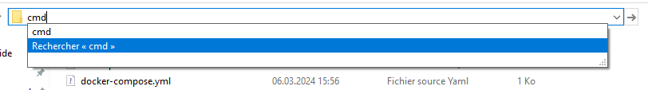
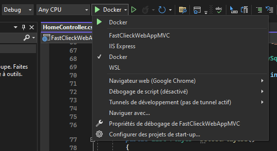
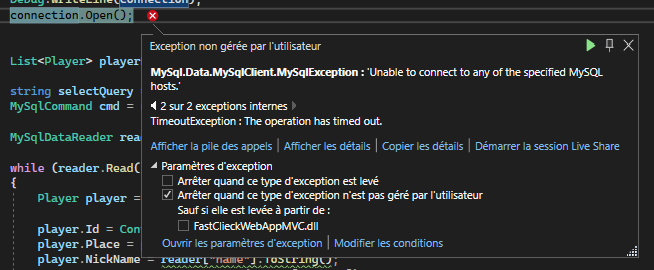

# FastClickedApp
Une simple application asp.net core (MVC) qui dockerisé

## Prérequis 
Afin de pouvoir correctement utiliser l'application voici les prérequis à avoir :
- Avoir <a href="https://www.docker.com/products/docker-desktop/">docker desktop</a> sur le son ordinateur : 


- Avoir <a href="https://visualstudio.microsoft.com/fr/downloads/">Visual Studio 2022</a> (ou plus) avec asp.net installé :


## Instalation 

Pour commencer à utiliser le programme il est necessaire d'installer le repos github sur votre poste. </br>

Une fois l'installation terminé il est necessaire de se diriger dans le dossier "docker-compose" et d'ouvrir une fenêtre CMD :



Une fois sur la page il est necessaire d'executer cette commande : 
```bash
docker compose up
```
Une fois que l'execution s'est terminée vous remaquerez qu'une conteneur s'est créer.

</br>
L'application peut maintenant être lancée en ouvrant le projet depuis Visual Studio.</br></br>

⚠ **Pour lancer votre application correctement il est necessaire de lancer l'application avec le bouton "Docker" sur Visual Studio :**



Après avoir démarré l'application, un message d'erreur spécifique doit apparaître que voici : 


Pour pouvoir résoudre le problème il est necessaire d'executer cette commande toujours dans un environnement CMD

```bash
docker network connect --ip 192.168.0.2 docker-compose_db_network FastClieckWebAppMVC
```

Maintenant vous pouvez lancer l'application sans risque de crash. Bon amusement !!


