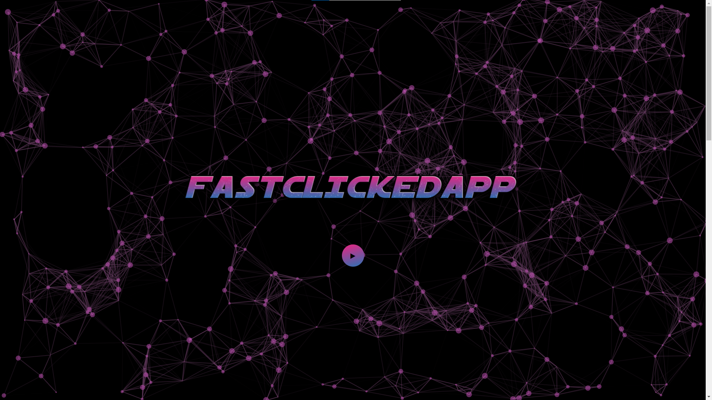

# FastClickedApp

Une simple application asp.net core (MVC) qui dockerisé

# Sommaire

- [Prérequis](#1-prérquis)
- [Installation](#2-installation)
- [Lancement](#3-lancement)
- [Bon jeu !!](#bon-jeu-)

## 1. Prérequis

Afin de pouvoir correctement utiliser l'application voici les prérequis à avoir :

- Avoir <a href="https://www.docker.com/products/docker-desktop/">docker desktop</a> sur le son ordinateur :
  

- Avoir <a href="https://visualstudio.microsoft.com/fr/downloads/">Visual Studio 2022</a> (ou plus) avec asp.net installé :
  

## 2. Installation

Pour commencer à utiliser le programme il est necessaire d'installer le repos github sur votre poste. </br>

soit en éxecutant cette commande git :

```git
git clone git@github.com:ThomNardou/FastClickedApp.git
```

soit depuis <a href="https://github.com/ThomNardou/FastClickedApp">GitHub</a> en téléchargant le ZIP :


## 3. Lancement

Maintenant que l'installation est terminée l'application peut être lancée mais il reste un paramètre à verifier qui est le mode de lancement. Pour ce faire il est necessaire dans visual studio (en double cliquant sur le fichier "**_FastClieckWebAppMVC.sln_**")de verifier le mode de lancement quoi doit s'appeler "docker-compose" :


</br>
</br>

Maintenant tout est prêt pour jouer pour lancer le programme il suffit sur le bouton "Docker Compose" :


</br>
</br>
</br>

> [!WARNING]
> **Il est possible que lors du lancement du programme les messages suivants apparaissent :**
>
> 
> 
>
> **Pour pouvoir lancer le prgramme il suffit d'appuyer sur "oui" sur les deux pages**


<h1 style="margin-top: 100px; text-align: center">Bon jeu !!</h1>

